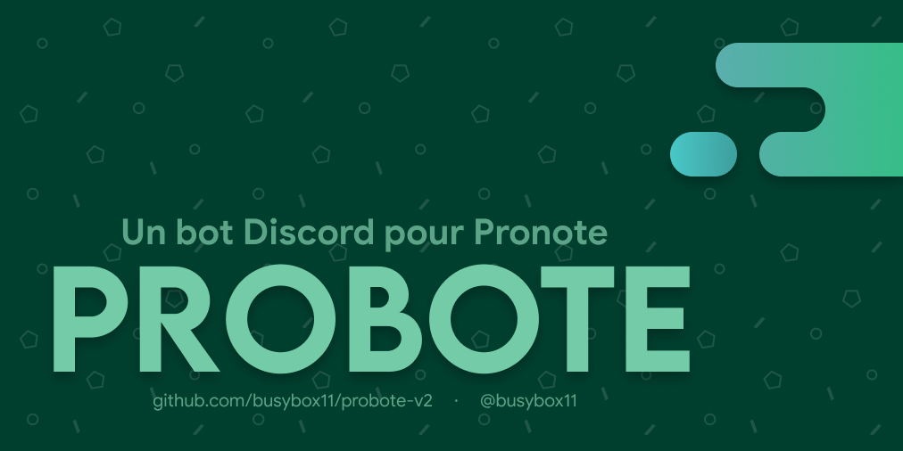

# CE BOT N'EST PLUS SUPPORTÉ ET NE FONCTIONNE PLUS
Suite à la suppression de la librarie [pronote-api de Litarvan](https://github.com/Litarvan/pronote-api) effectuée par Index-Education, je ne suis plus en mesure de continuer le support de ce bot. Le téléchargement des dépendances nécessaires produira une erreur. Vous pouvez intégrer vous-mêmes une nouvelle implémentation de Pronote si vous le souhaitez, mais je ne peux plus le faire de mon côté.

# probote-v2
Rewrite de Probote en NodeJS

## Rappel
Ce bot est lié à un compte élève **mais pas** à la classe entière !

Si le compte utilisé sur le bot n'a pas accès aux devoirs / notes / autres éléments de la classe (ex. groupes de langues, spécialités), le bot ne pourra pas non plus les afficher.

## Installation
- Installer NodeJS et npm (JustGoogleIt)
- Cloner le repo
    * `git clone https://github.com/busybox11/probote-v2` via HTTPS
    * `git clone git@github.com:busybox11/probote-v2.git` via SSH
- Installer les dépendances (`npm i`)
- Copier le fichier `.env.example` vers un nouveau appelé `.env`
- Modifier les valeurs correspondantes du fichier `.env` (Guide en cours d'écriture)
- Lancer le bot (fonctionne évidemment avec `pm2`)

## Configuration
**Section à venir**

TODO:
- Ajout des modules à charger dans la configuration

## Pronote
- [X] Devoirs (Support des fichiers attachés manquant)
- [ ] Changements de cours
- [X] Notes
- [X] Menu de la cantine
- [ ] Infos
- [X] Trimestre

## Modules
- Fun :
   * [X] Chuck Norris
   * [X] Saucisse
   * [X] Loutre
   * [X] Inspirobot
- Basic :
   * [X] Module d'invitations
            (Génère un QR code avec le lien d'invitation pour un partage du serveur plus facile)

## Plateformes
- [X] Discord
- [ ] Instagram
- [ ] Telegram
